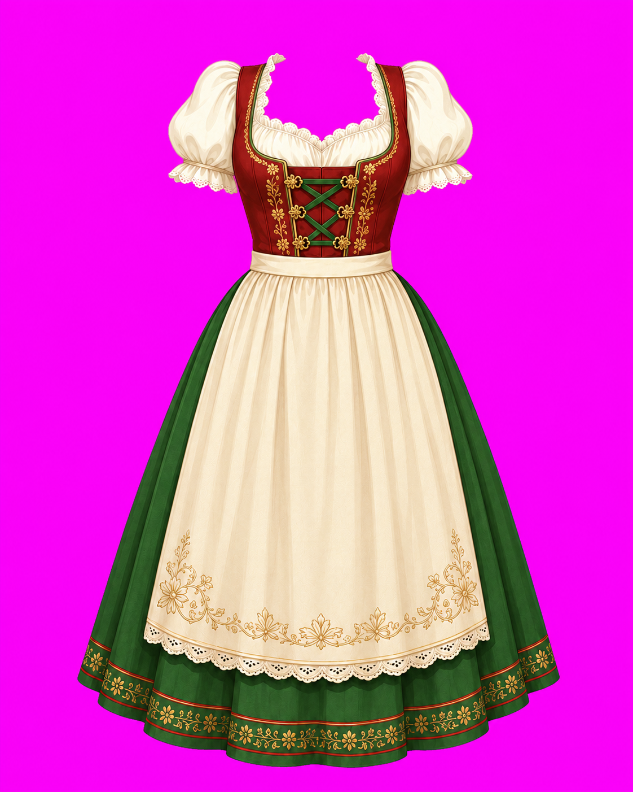
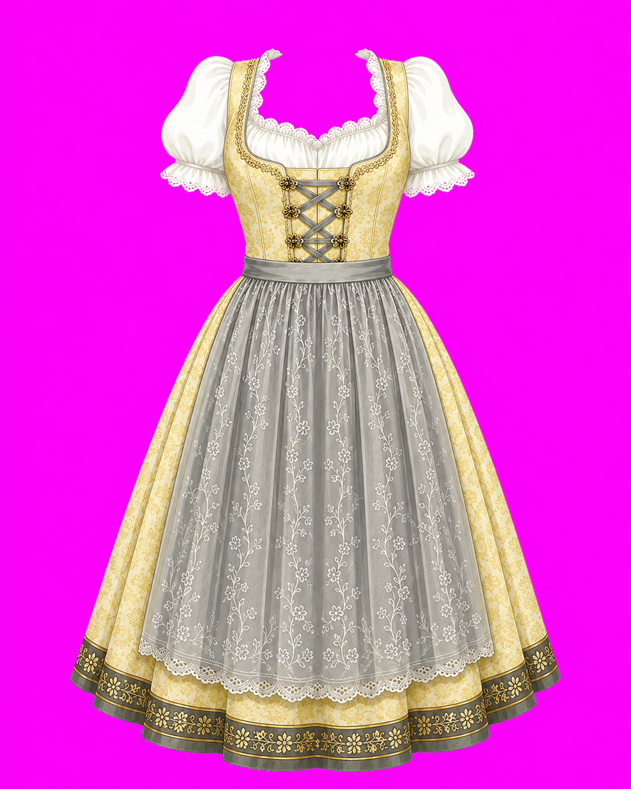
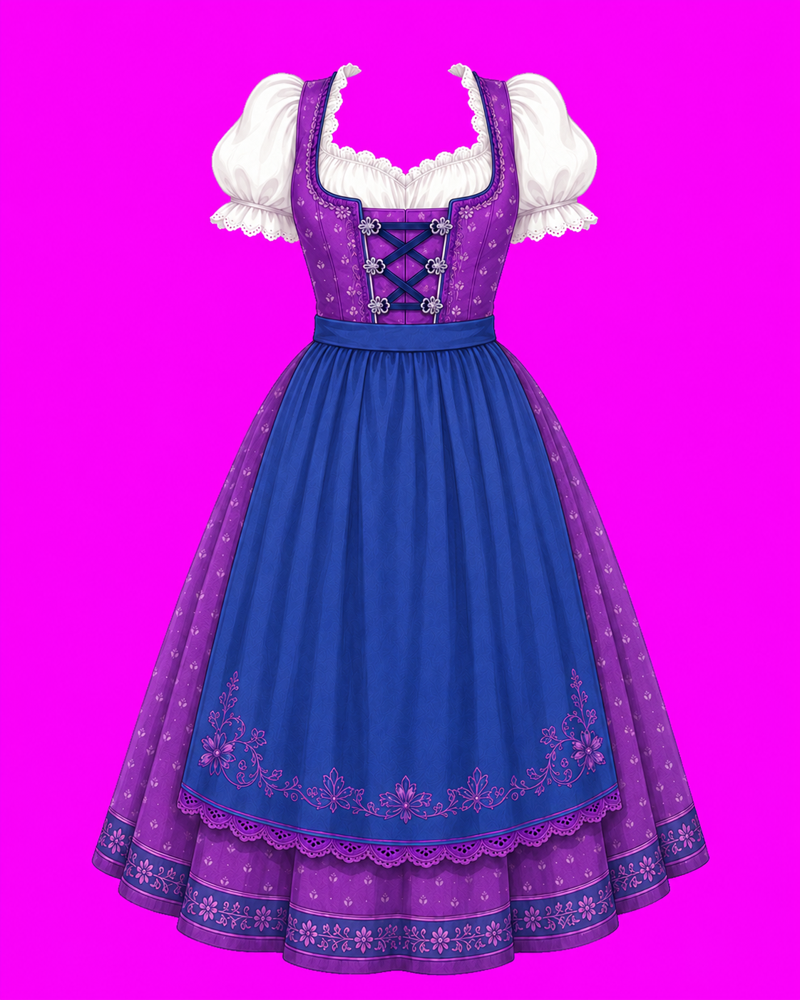
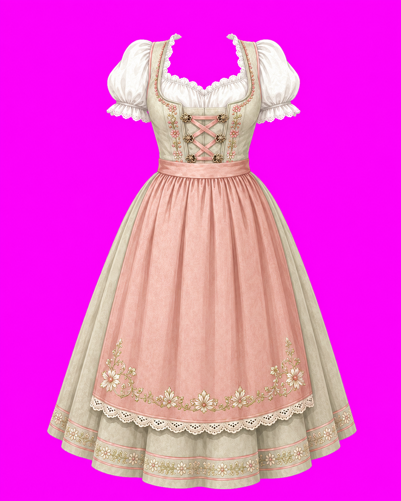
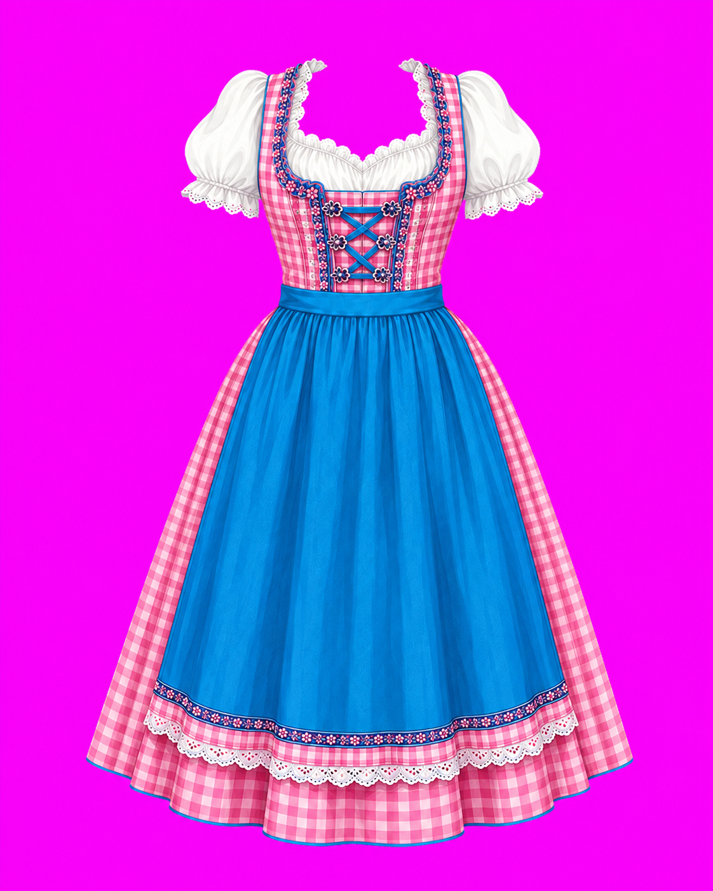
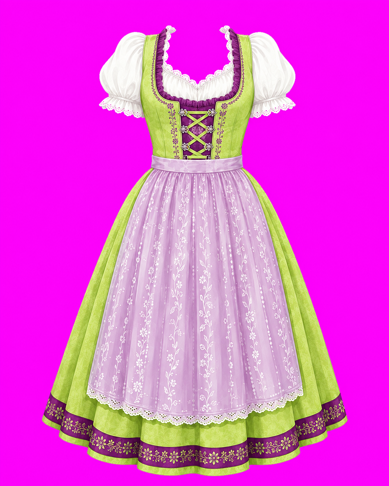
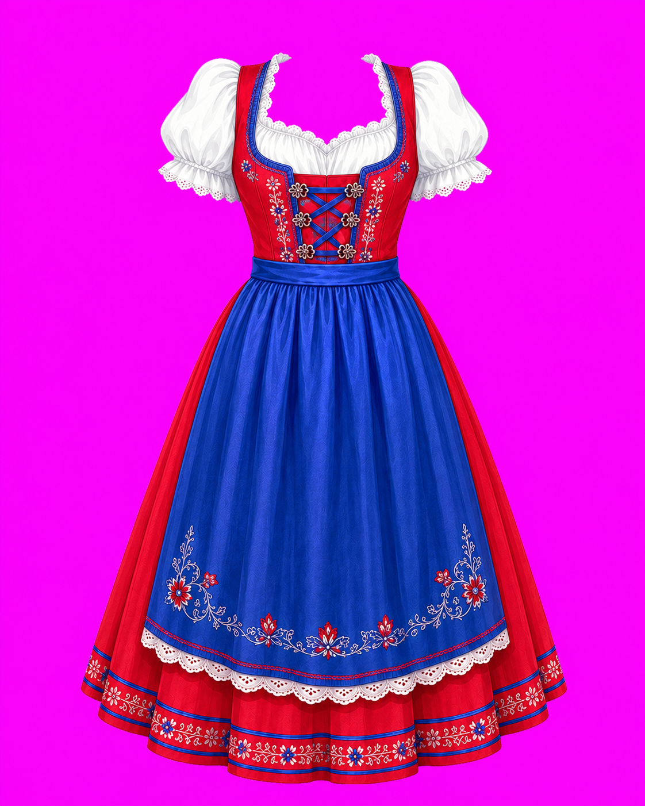
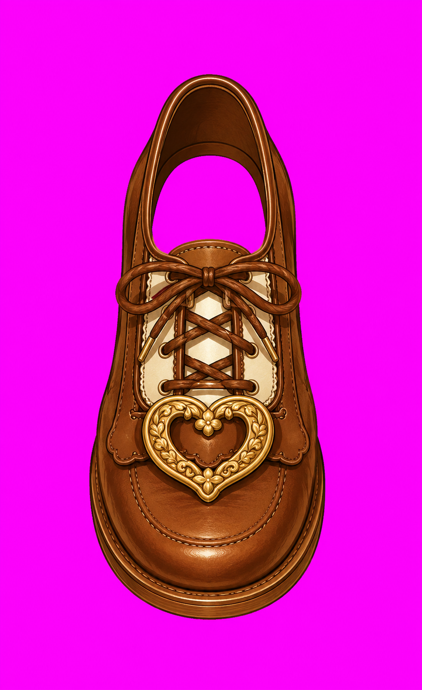

<!DOCTYPE html>
<html lang="ja">
<head>
  <meta charset="UTF-8">
  <meta name="viewport" content="width=device-width, initial-scale=1.0">
  <title>オクトーバーフェスト・アバターメーカー</title>
  
  
  
  
</head>
<body class="flex flex-col items-center justify-between min-h-screen p-4 pb-6">

  <header class="text-center my-2">
    <h1 class="text-2xl font-bold text-amber-800">🍻 Oktoberfest Maker 🍻</h1>
    
自分だけのフェス衣装を作ろう！

  </header>

  <!-- 撮影モード（カメラ）と 画像きせかえモード の切り替えタブ -->
  

    <button onclick="setMode('camera')" id="mode-camera" class="flex-1 py-2 text-xs font-bold rounded-md bg-amber-600 text-white shadow-sm transition">
      📸 リアルタイム外カメラ
    </button>
    <button onclick="setMode('image')" id="mode-image" class="flex-1 py-2 text-xs font-bold rounded-md text-amber-800 transition">
      🖼️ 画像きせかえ
    </button>
  

  <!-- キャンバスエリア -->
  

    <video id="webcam" autoplay playsinline muted style="display:none;"></video>
    <canvas id="avatarCanvas" width="350" height="420"></canvas>
  

  <!-- 操作パネル -->
  

    
    <!-- カテゴリ選択タブ -->
    

      <button onclick="switchCategory('costume')" id="tab-costume" class="flex-1 py-3 text-sm font-bold text-amber-800 border-b-2 border-amber-600 text-center">
        👗 衣装
      </button>
      <button onclick="switchCategory('item')" id="tab-item" class="flex-1 py-3 text-sm font-bold text-gray-500 text-center">
        🎀 小物
      </button>
      <!-- 向き・重ね順の調整タブ -->
      <button onclick="switchCategory('adjust')" id="tab-adjust" class="flex-1 py-3 text-sm font-bold text-gray-500 text-center">
        🔄 向き・重なり調整
      </button>
    

    <!-- アイテム・調整選択パネル -->
    

      <!-- 1. 衣装カテゴリ（ボタンのアイコンを実際の画像に変更しました） -->
      

        <button onclick="addAppImage('d-1.png', 200)" class="flex-shrink-0 w-20 h-20 bg-white border-2 border-amber-200 rounded-lg flex flex-col items-center justify-center shadow-sm hover:border-amber-500 overflow-hidden">
          
          衣装1
        </button>
        <button onclick="addAppImage('d-2.png', 200)" class="flex-shrink-0 w-20 h-20 bg-white border-2 border-amber-200 rounded-lg flex flex-col items-center justify-center shadow-sm hover:border-amber-500 overflow-hidden">
          
          衣装2
        </button>
        <button onclick="addAppImage('d-3.png', 200)" class="flex-shrink-0 w-20 h-20 bg-white border-2 border-amber-200 rounded-lg flex flex-col items-center justify-center shadow-sm hover:border-amber-500 overflow-hidden">
          
          衣装3
        </button>
        <button onclick="addAppImage('d-4.png', 200)" class="flex-shrink-0 w-20 h-20 bg-white border-2 border-amber-200 rounded-lg flex flex-col items-center justify-center shadow-sm hover:border-amber-500 overflow-hidden">
          
          衣装4
        </button>
        <button onclick="addAppImage('d-5.png', 200)" class="flex-shrink-0 w-20 h-20 bg-white border-2 border-amber-200 rounded-lg flex flex-col items-center justify-center shadow-sm hover:border-amber-500 overflow-hidden">
          
          衣装5
        </button>
        <button onclick="addAppImage('d-6.png', 200)" class="flex-shrink-0 w-20 h-20 bg-white border-2 border-amber-200 rounded-lg flex flex-col items-center justify-center shadow-sm hover:border-amber-500 overflow-hidden">
          
          衣装6
        </button>
        <button onclick="addAppImage('d-7.png', 200)" class="flex-shrink-0 w-20 h-20 bg-white border-2 border-amber-200 rounded-lg flex flex-col items-center justify-center shadow-sm hover:border-amber-500 overflow-hidden">
          
          衣装7
        </button>
      

      <!-- 2. 小物カテゴリ（ボタンのアイコンをリボンやシューズの画像に変更しました） -->
      

        <button onclick="addAppImage('r-1.png', 100)" class="flex-shrink-0 w-20 h-20 bg-white border-2 border-amber-200 rounded-lg flex flex-col items-center justify-center shadow-sm hover:border-amber-500 overflow-hidden">
          
          リボン
        </button>
        <button onclick="addAppImage('s-1.png', 100)" class="flex-shrink-0 w-20 h-20 bg-white border-2 border-amber-200 rounded-lg flex flex-col items-center justify-center shadow-sm hover:border-amber-500 overflow-hidden">
          
          シューズ1
        </button>
        <button onclick="addAppImage('s-a.png', 100)" class="flex-shrink-0 w-20 h-20 bg-white border-2 border-amber-200 rounded-lg flex flex-col items-center justify-center shadow-sm hover:border-amber-500 overflow-hidden">
          
          シューズA
        </button>
      

      <!-- 3. 向き・重なり調整カテゴリ -->
      

        <button onclick="flipSelectedX()" class="flex-1 py-3 bg-white border border-gray-300 rounded-lg text-xs font-bold text-gray-700 shadow-sm hover:bg-gray-100 flex flex-col items-center justify-center">
          🔄 左右反転
          人物の向きに合わせる
        </button>
        <button onclick="adjustLayer('up')" class="flex-1 py-3 bg-white border border-gray-300 rounded-lg text-xs font-bold text-gray-700 shadow-sm hover:bg-gray-100 flex flex-col items-center justify-center">
          ➕ 重ね順を上に
          衣装を前に出す
        </button>
        <button onclick="adjustLayer('down')" class="flex-1 py-3 bg-white border border-gray-300 rounded-lg text-xs font-bold text-gray-700 shadow-sm hover:bg-gray-100 flex flex-col items-center justify-center">
          ➖ 重ね順を下に
          小物を後ろに隠す
        </button>
      

    

    <!-- アクションボタンエリア -->
    

      <!-- 画像きせかえモードの時だけ表示される、アルバム写真アップロードボタン -->
      

        <input type="file" id="uploadPhoto" accept="image/*" class="hidden" />
        <button onclick="document.getElementById('uploadPhoto').click()" class="w-full bg-amber-50 border border-amber-300 text-amber-800 font-bold py-2 rounded-lg text-sm text-center shadow-sm">
          📸 アルバムから写真を選択
        </button>
      

      

        <button onclick="deleteSelected()" class="w-full bg-red-50 border border-red-300 text-red-700 font-bold py-2 rounded-lg text-sm text-center shadow-sm">
          🗑️ 選択した衣装・小物を消去
        </button>
      

      <button onclick="exportImage()" class="w-full bg-amber-600 hover:bg-amber-700 text-white font-bold py-3 rounded-lg shadow-md transition text-sm">
        💾 この姿で写真を保存する
      </button>
      <button onclick="shareToLINE()" id="shareButton" class="w-full bg-[#06C755] hover:bg-[#05b34c] text-white font-bold py-3 rounded-lg shadow-md transition text-sm hidden">
        💬 LINEの友達に送る
      </button>
    

  

  
</body>
</html>
